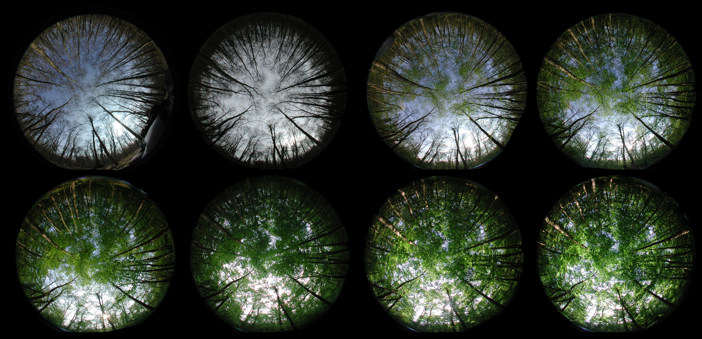
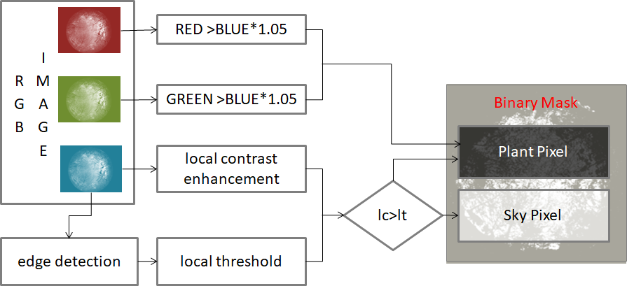

# CanopyGapAnalyzer

Segmentation and analysis of hemispherical images to estimate leaf area index (LAI) and further parameters



These tools are designed to calculate Leaf Area Index (LAI) and further canopy parameters, such as transmission and gap fraction, for batches of hemispherical images.
The first sep is a segmentation of the image into plant/sky pixels. The segmentation method used here is a novel approach based on local contrast enhancement, and allows also to process images that were taken in not ideal conditions. 



The image is then split into a number of concentrical circles and angular segment, and the transmission for each segment is calculated. Finally LAI functions include:

	* Norman and Campbell (1989)
	* Miller (1967) LiCor generalized
	* Miller (1967) LAI within Rings
	* LiCor original
	* Lang (1987)

## Tools
The tools provided with this script are:
* ImageSetup.py: a GUI tool in order to set mark the rotation (set North) and mask certain areas of the image to be ignored (sun) or analysed seperately.
* NorthCorrected.py: Rotate Images so that North is on top. This script uses the parameters in the *.par file (for example created my ImageSetup)
* Overview.py: Stack Images togeter to create an overview

## Installation and Usage

	Just copy the files into a filder of your choice. Rund the script by
```	
	./CGA.py [imagepath] [outpath]
	e.g.
	./CGA.py ./TestFiles ./out
```	
	
## Parameter File
For each Image a parameter file is created. The file contains 2 lines, a header and a dataline (columns seperated by semicolons):
```
SITE;OBS;LAT;LON;ALT;TIME;CENTER;RADIUS;NORTH;WOOD
F1_001;O1;47.7048833333333;7.47076666666667;244;24.03.2011 10:13:47;[1000, 800];750;280.400983435;001_o1_dscn0141.jpg
```
The Fields are defindes as follows:
* SITE: Site identifier
* OBS: Observation identifier
* LAT: Geographical latitude
* LON: Geographical longitude
* ALT: Elevation
* TIME: Date and time when the image was taken
* CENTER: [x,y]  coordinates of the center pixel
* RADIUS: Radius of the Image
* NORTH: Rotation angle indicating the direction to North
* WOOD: path to the referece image that doeas not have leafs (to accurately estimate LAI)

## Note
This code was first written 2011, I'm currently testing if it still works as intended. 
	